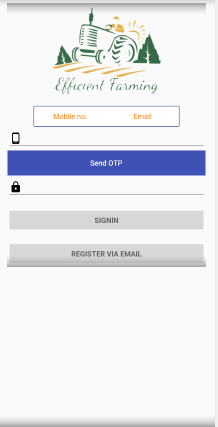
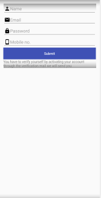
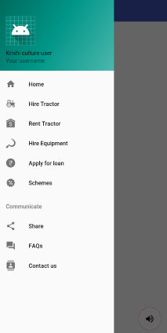
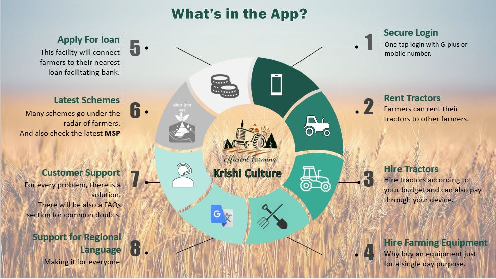

# Krishi Culture

A mobile application that the farmers can use to hire tractors as well as other mechanizations at a nominal amount all using their mobile phones . This would not only help them avoid manual labor but can be also be considered as an important step to encourage this profession.

##  Features
- A one-click simple application to rent farming equipment.
-	The farmer can sign up using email or mobile verification
-	Targeting a farmers mobile as well as kiosks (android based using android device or emulators) that would be kept in multiple locations in the farmer's proximity. 
-	The farmers can then use this application to rent or hire tractors as well as farming equipment/mechanizations at a nominal amount. 
-	For more tech-savvy farmers there will be an option to display a list of rental agencies involved/registered in this program along with their contact details as well as the equipment cost. 
-	There is a speaker button on the bottom-right corner of the app which will read aloud the basic functionality of the screen that you opened in the regional language. You can select the language while registering for the app or whenever you feel so by accessing the settings. 
-	The user will be able to apply for loan through the app
-	Farmers can also access details about various government schemes for farmers
-	Future updates will also help in determining the climate
-	By registering with a payment gateway (to be done by app administrator), the user will be able to pay via the app for the rental. The user will also receive messages for the payment transactions by payment gateway. 
    >  Note: This will be only implemented at the final phase of the project as payment gateway requires a lot of documents and some fees which will be paid by the organization itself. So, we won't add this feature right now. 

## Screenshots:
                       

## Technology Stack:
*The entire project is divided into 2 applications. One is the main android app for the users to access the data and features that the project has to offer. Second is the admin panel that allows an administrator to deal with loan applications and forward them, update application status etc.*
**For  App:**
>Android with Java
>Backend as Service - Firebase
    
**For  Admin Panel:**
>Serverless React JS

## Assumptions:
- Farmer is registered and verified.
- User knows how to operate basic features of mobile phone.
- Phone has internet connectivity.
- The product is available for which the User want to book for him.

### About Mindtree:
Mindtree delivers digital transformation and technology services from ideation to execution, enabling Global 2000 clients to outperform the competition. “Born digital,” Mindtree takes an agile, collaborative approach to creating customized solutions across the digital value chain. Our deep expertise in infrastructure and applications management turns IT into a strategic asset. Whether you need to run your business more efficiently or accelerate revenue growth, Mindtree can get you there.

### Support:
What do you think about this?Contact:
- [Sahil](https://www.github.com/imsahil007)
- [Abhishek](https://www.github.com/abhi12299)

### Todos

 - Add complete functionality of the classes
 - Push the admin interface for accessing all data

